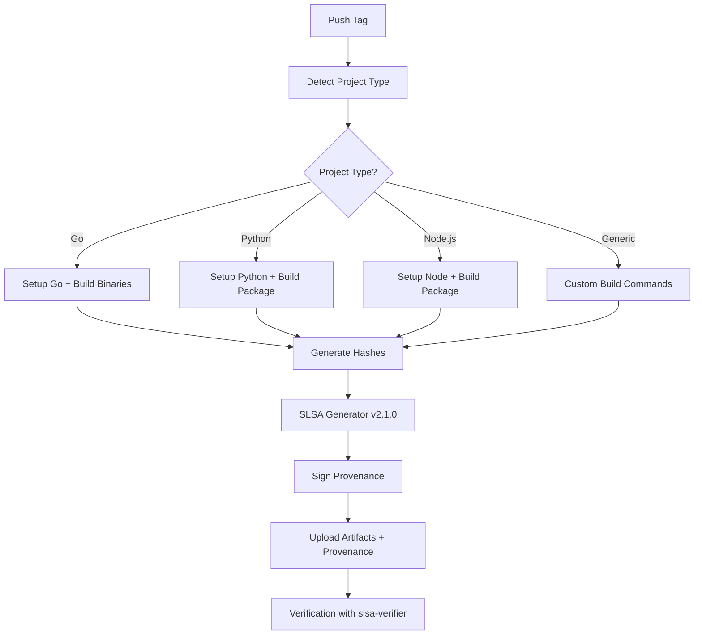

# Generic SLSA Provenance Workflow

A comprehensive, language-agnostic GitHub Actions workflow that generates SLSA Level 3 provenance for any artifact type and provides verification using the official `slsa-verifier` tool.

## 🎯 Overview

This implementation provides a **single, universal workflow** that can:

- **Auto-detect** project types (Go, Python, Node.js, or generic)
- **Generate SLSA Level 3 provenance** using the official SLSA generator
- **Support any artifact type** with custom build commands
- **Verify provenance** using the official `slsa-verifier` tool
- **Work consistently** across all programming languages and frameworks

## 🚀 Quick Start

### 1. Add the Workflow

Copy [`generic-slsa.yml`](.github/workflows/generic-slsa.yml) to your repository's `.github/workflows/` directory.

### 2. Generate Provenance

```bash
# Automatic detection and build
git tag v1.0.0
git push origin v1.0.0
```

### 3. Verify Provenance

```bash
# Install slsa-verifier
go install github.com/slsa-framework/slsa-verifier/v2/cli/slsa-verifier@latest

# Verify artifacts
./verify_generic_slsa.sh -r owner/repo -t v1.0.0
```

## ⚙️ Workflow Input Fields

When running the workflow manually, you can configure these input fields:

### 📋 Input Field Reference

| Field | Purpose | When to Use | Examples |
|-------|---------|-------------|----------|
| **`artifact_type`** | Override auto-detection | When you want specific build behavior | `go`, `python`, `nodejs`, `generic` |
| **`tag`** | Version tag for release | When building for a specific version | `v1.0.0`, `release-2024-01`, `beta-1.2` |
| **`build_command`** | Custom build instructions | For unsupported languages or custom builds | `cargo build --release`, `make all` |
| **`artifact_pattern`** | Files to include in provenance | When artifacts are in non-standard locations | `target/release/*`, `dist/*.whl` |

### 🎯 Universal Auto-Detection (Recommended)

**Leave ALL fields empty** for automatic detection and optimal defaults:

```yaml
Branch: main
artifact_type: [LEAVE EMPTY]
tag: [LEAVE EMPTY]
build_command: [LEAVE EMPTY]
artifact_pattern: [LEAVE EMPTY]
```

**What happens:**
- ✅ **Auto-detects** project type (Go, Python, Node.js, or generic)
- ✅ **Uses optimal** build commands for detected language
- ✅ **Applies best practices** for artifact patterns
- ✅ **Creates release** with commit hash as identifier

### 🔧 Manual Override Examples

#### **🐹 Go Project Override:**
```yaml
artifact_type: go
tag: go-v1.0.0
build_command: [LEAVE EMPTY]  # Uses: cross-platform Go builds
artifact_pattern: [LEAVE EMPTY]  # Uses: zobra-slsa-*
```

#### **🐍 Python Project Override:**
```yaml
artifact_type: python
tag: python-v1.0.0
build_command: [LEAVE EMPTY]  # Uses: python -m build
artifact_pattern: [LEAVE EMPTY]  # Uses: dist/* files only
```

#### **🦀 Rust Project (Generic):**
```yaml
artifact_type: generic
tag: rust-v1.0.0
build_command: cargo build --release
artifact_pattern: target/release/*
```

#### **☕ Java/Maven Project (Generic):**
```yaml
artifact_type: generic
tag: java-v1.0.0
build_command: mvn clean package
artifact_pattern: target/*.jar
```

#### **🔷 C# .NET Project (Generic):**
```yaml
artifact_type: generic
tag: dotnet-v1.0.0
build_command: dotnet build --configuration Release
artifact_pattern: bin/Release/net8.0/*
```

### 📖 Field Details

#### **`artifact_type`**
- **Purpose**: Controls which build system to use
- **Auto-detection priority**: `go.mod` → `pyproject.toml` → `package.json` → `generic`
- **Valid values**: `go`, `python`, `nodejs`, `generic`
- **Leave empty**: For automatic detection (recommended)

#### **`tag`**
- **Purpose**: Creates a GitHub release with this tag name
- **Format**: Any valid Git tag (e.g., `v1.0.0`, `release-2024-01`)
- **Leave empty**: Uses commit hash as release identifier
- **Best practice**: Use semantic versioning (`v1.0.0`)

#### **`build_command`**
- **Purpose**: Shell command(s) to build your artifacts
- **Multi-line support**: Use `|` for complex builds
- **Leave empty**: Uses language-specific defaults
- **Examples**:
  - `make all`
  - `cargo build --release`
  - `docker build -t app . && docker save app -o app.tar`

#### **`artifact_pattern`**
- **Purpose**: Glob pattern matching files to include in provenance
- **Supports**: Wildcards (`*`), specific files, directories
- **Leave empty**: Uses language-specific patterns
- **Examples**:
  - `target/release/*` (Rust binaries)
  - `dist/*.whl dist/*.tar.gz` (Python packages)
  - `build/bin/myapp` (specific binary)

### 🌍 Language-Specific Defaults

When using auto-detection, these defaults are applied:

#### **🐹 Go Projects** (`go.mod` detected):
```yaml
build_command: "Cross-platform builds for Linux, macOS, Windows"
artifact_pattern: "zobra-slsa-*"
artifact_path: "."
```

#### **🐍 Python Projects** (`pyproject.toml` detected):
```yaml
build_command: "python -m build"
artifact_pattern: "*"  # Files only in dist/
artifact_path: "dist"
```

#### **📦 Node.js Projects** (`package.json` detected):
```yaml
build_command: "npm run build && npm pack"
artifact_pattern: "*.tgz"
artifact_path: "."
```

#### **🔧 Generic Projects** (fallback):
```yaml
build_command: "[MANUAL INPUT REQUIRED]"
artifact_pattern: "*"
artifact_path: "."
```

## 📁 Files Included

| File | Purpose |
|------|---------|
| [`.github/workflows/generic-slsa.yml`](.github/workflows/generic-slsa.yml) | Main workflow file - handles all artifact types |
| [`verify_generic_slsa.sh`](verify_generic_slsa.sh) | Verification script using slsa-verifier |
| [`GENERIC_SLSA_GUIDE.md`](GENERIC_SLSA_GUIDE.md) | Complete usage guide and documentation |
| [`EXAMPLE_USAGE.md`](EXAMPLE_USAGE.md) | Practical examples and troubleshooting |
| [`SLSA_REQUIREMENTS.md`](SLSA_REQUIREMENTS.md) | SLSA implementation requirements |

## 🔍 Supported Project Types

### Automatic Detection

The workflow automatically detects your project type:

| Project Type | Detection | Build Output |
|--------------|-----------|--------------|
| **Go** | `go.mod` present | Cross-platform binaries |
| **Python** | `pyproject.toml`, `setup.py`, or `setup.cfg` | Wheel and source distribution |
| **Node.js** | `package.json` present | NPM package (`.tgz`) |
| **Generic** | No specific files found | Custom build commands |

### Manual Override

You can override auto-detection using workflow dispatch parameters:

- **Artifact Type**: `auto`, `go`, `python`, `nodejs`, `generic`
- **Build Command**: Custom build command (for generic type)
- **Artifact Pattern**: Pattern to match artifacts (for generic type)

## 🛡️ Security Features

### SLSA Level 3 Compliance

✅ **Non-forgeable Provenance**: Uses official SLSA generator v2.1.0  
✅ **Ephemeral Environment**: Fresh GitHub Actions runners  
✅ **Cryptographic Verification**: Sigstore-based signatures  
✅ **Transparency**: Public transparency log recording  

### Provenance Contents

Each provenance file contains:
- Builder identity (SLSA generator)
- Source repository and commit
- Build environment and parameters
- Artifact hashes (SHA256)
- Cryptographic signature

## 📊 Workflow Architecture



## 🧪 Testing with Zobra Packages

This repository includes two test packages:

### Go Package (`zobra-go`)
- **Source**: [`main.go`](main.go)
- **Build**: Cross-platform binaries (Linux, macOS, Windows)
- **Trigger**: `git tag go-v1.0.0`

### Python Package (`zobra`)
- **Source**: [`zobra/`](zobra/) directory
- **Build**: Wheel and source distribution
- **Trigger**: `git tag py-v1.0.0`

## 📖 Usage Examples

### Basic Usage

```bash
# Auto-detect and verify
./verify_generic_slsa.sh -r owner/repo -t v1.0.0

# Specify artifact type
./verify_generic_slsa.sh -r owner/repo -t v1.0.0 -a python

# Verify existing files
./verify_generic_slsa.sh -r owner/repo -t v1.0.0 -v \
  -p ./artifact.whl -s ./provenance.intoto.jsonl
```

### Advanced Configuration

```yaml
# Manual workflow dispatch for Rust project
artifact_type: generic
build_command: "cargo build --release"
artifact_pattern: "target/release/myapp*"
```

### CI/CD Integration

```yaml
- name: Verify SLSA Provenance
  run: |
    ./verify_generic_slsa.sh -r ${{ github.repository }} -t ${{ github.ref_name }}
```

## 🔧 Prerequisites

### For Generation (GitHub Actions)
- Repository with the workflow file
- Appropriate permissions (actions: read, id-token: write, contents: write)

### For Verification (Local)
- [`slsa-verifier`](https://github.com/slsa-framework/slsa-verifier): `go install github.com/slsa-framework/slsa-verifier/v2/cli/slsa-verifier@latest`
- [GitHub CLI](https://cli.github.com/): For downloading artifacts

## 🆚 Comparison with Language-Specific Workflows

| Feature | Generic Workflow | Language-Specific |
|---------|------------------|-------------------|
| **Languages Supported** | All | Single language |
| **Maintenance** | Single workflow | Multiple workflows |
| **Consistency** | Same process for all | Different per language |
| **Flexibility** | High (custom builds) | Limited to language |
| **Security Level** | SLSA Level 3 | SLSA Level 3 |
| **Verification** | Universal tool | Universal tool |

## 🚨 Migration from Existing Workflows

### Step 1: Backup Existing Workflows
```bash
cp .github/workflows/go-slsa.yml .github/workflows/go-slsa.yml.backup
cp .github/workflows/python-slsa.yml .github/workflows/python-slsa.yml.backup
```

### Step 2: Add Generic Workflow
```bash
cp generic-slsa.yml .github/workflows/
```

### Step 3: Test with New Tags
```bash
git tag generic-v1.0.0
git push origin generic-v1.0.0
```

### Step 4: Verify Results
```bash
./verify_generic_slsa.sh -r owner/repo -t generic-v1.0.0
```

### Step 5: Remove Old Workflows (Optional)
```bash
rm .github/workflows/go-slsa.yml
rm .github/workflows/python-slsa.yml
```

## 📚 Documentation

- **[Complete Guide](GENERIC_SLSA_GUIDE.md)**: Detailed usage instructions
- **[Examples](EXAMPLE_USAGE.md)**: Practical examples and troubleshooting
- **[Requirements](SLSA_REQUIREMENTS.md)**: SLSA implementation details
- **[SLSA Framework](https://slsa.dev/)**: Official SLSA documentation

## 🤝 Contributing

1. Test the workflow with your project type
2. Report issues or suggest improvements
3. Share your custom build configurations
4. Help improve documentation

## 📄 License

This project is licensed under the MIT License - see the [LICENSE](LICENSE) file for details.

## 📋 Quick Reference - Copy & Paste Inputs

### 🌍 Universal Auto-Detection (Recommended)
```
Branch: main
artifact_type: [LEAVE EMPTY]
tag: [LEAVE EMPTY]
build_command: [LEAVE EMPTY]
artifact_pattern: [LEAVE EMPTY]
```

### 🦀 Rust Project
```
Branch: main
artifact_type: generic
tag: rust-v1.0.0
build_command: cargo build --release
artifact_pattern: target/release/*
```

### 🦎 Zig Project
```
Branch: main
artifact_type: generic
tag: zig-v1.0.0
build_command: zig build -Doptimize=ReleaseFast
artifact_pattern: zig-out/bin/*
```

### ☕ Java/Maven Project
```
Branch: main
artifact_type: generic
tag: java-v1.0.0
build_command: mvn clean package
artifact_pattern: target/*.jar
```

### 🔷 C# .NET Project
```
Branch: main
artifact_type: generic
tag: dotnet-v1.0.0
build_command: dotnet build --configuration Release
artifact_pattern: bin/Release/net8.0/*
```

### 💎 Ruby Gem Project
```
Branch: main
artifact_type: generic
tag: ruby-v1.0.0
build_command: gem build *.gemspec
artifact_pattern: *.gem
```

### 🐘 PHP Composer Project
```
Branch: main
artifact_type: generic
tag: php-v1.0.0
build_command: composer install --no-dev && composer dump-autoload --optimize
artifact_pattern: vendor/autoload.php
```

### 🏗️ CMake C++ Project
```
Branch: main
artifact_type: generic
tag: cmake-v1.0.0
build_command: mkdir -p build && cd build && cmake .. && make -j$(nproc)
artifact_pattern: build/*
```

### 📦 Docker Container
```
Branch: main
artifact_type: generic
tag: docker-v1.0.0
build_command: docker build -t myapp:latest . && docker save myapp:latest -o myapp.tar
artifact_pattern: myapp.tar
```

## 🙏 Acknowledgments

- [SLSA Framework](https://slsa.dev/) for supply chain security standards
- [SLSA GitHub Generator](https://github.com/slsa-framework/slsa-github-generator) for the official generator
- [slsa-verifier](https://github.com/slsa-framework/slsa-verifier) for verification tools
- GitHub Actions for the CI/CD platform

---

**🎯 Ready to secure your supply chain?** Start with the [Quick Start](#-quick-start) guide above!
